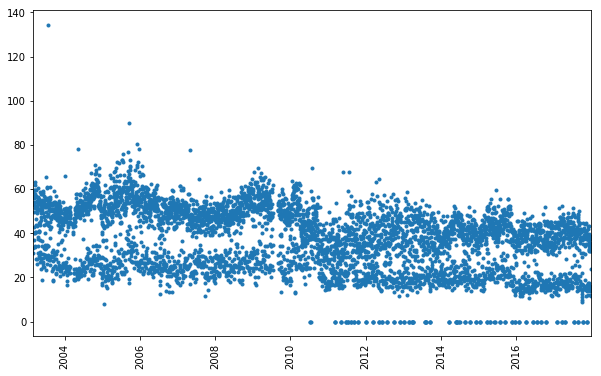

# 목적

특정 날의 식수 인원을 예측하고 싶다. 주어진 데이터는 2003년-2017년사이의 식수인원과 각각의 날짜에 해당하는 식단으로 구성되어 있다. 첫번째 시도로는 식단은 신경쓰지 않고 (일단, 신경쓰지않는 것 당연히 식수 인원에 영향을 주는 것은 식단) 과거의 식수인원만 참고해서 식사인원을 예측해보자. 쉽게생각해서 일요일이면 해당 달, 주의 식수 인원과 과거 일요일의 식수인원을 적당히 참고하면 정확히는 아니어도 대략적으로 식수인원을 맞출 수 있을 것이라 생각한다.


# 데이터 취득
따라서 일단은 식단은 제외하고 날짜와 식수인원 데이터를 가져와보자. 데이터를 가져오면 `날짜`, `식사종류`, `식수인원` 이렇게 세개의 칼럼으로 이루어져있다. 여기서, `식사종류`의 경우 아침식사1, 아침식사2 이런식으로 구성되어있기 때문에 정리를 해줄 필요가 있다. 새로운 칼럼인 `type1`을 만들어서 1, 2에 상관없이 morning, lunch, dinner로 정리한다.

```
date        	type	    values  	type2	  type1
1	2003-03-01	아침식사	37.472924	morning	morning
2	2003-03-01	점심식사	31.191336	lunch_kor	lunch
3	2003-03-01	저녁식사	19.566787	dinner	dinner
4	2003-03-02	아침식사	36.101083	morning	morning
5	2003-03-02	점심식사	33.357401	lunch_kor	lunch
```

이렇게 만들면 점심식사1, 점식식사2가 모두 lunch로 정리된 `type1` 칼럼이 생긴다. 이제 해볼건 같은 `date`의 같은 `type1`을 가지면 그 value(식수인원)를 합쳐주어야 한다. 갓 pandas님의 기능을 활용한다. `groupby` 사용. sum을 통해서 `values`를 합쳐준다. 여기까지만 하면 index가 `date`인데, 편의를 위해서 reset_index를 해준다. (근데사실 나중에 `date`를 다시 index로 만들어줄때가 있다. 그때는 set_index('date')사용)

```python
peopleDfSumType1 = peopleDfRaw.groupby(['date', 'type1']).sum().reset_index()

# 점심에 해당하는 데이터만 추출
peopleDfSumType1.loc[peopleDfSumType1['type1'] == 'lunch']

```

이 데이터를 살펴보면 아래와 같다. 일단 어떨떈 많고 어떨떈 적은 것을 보이는데, 데이터를 살펴보면 (그리고 상식적으로도) 주중에는 식사량이 많고, 주말에는 식사량이 적은 것을 보인다. 또한 2011년부터 식사량이 0인 지점들이 보이는데 아마도 이부분들이 모두 우리가 맞춰야 하는 날짜를 의미한다.



또한 feature로 요일정보를 사용할 계획.

```python
peopleDfAllDate['weekday'] = peopleDfAllDate.index.weekday
```

__추가사항__

맞춰야하기 때문에 식수인원이 0 으로 표시된 날짜는 총 150일이 존재. 하지만, 날짜 자체가 누락된 77일이 추가로 존재함 (lunch에 해당). 이 부분을 어떻게 처리할지 고민해볼 필요가 있음. 일단 RNN input의 경우 time window 로 잘라서 넣어주어야한다.

[1 2 3 4 5 빈칸 6 7 8 9 10] 와같은 데이터가 있고 윈도우 사이즈가 3 이라고 하면, [1 2 3], [2, 3, 4], [3, 4, 5], [6, 7, 8] ... 이런식으로 데이터를 넣을 계획. 일부데이터 정보를 잃는다.
